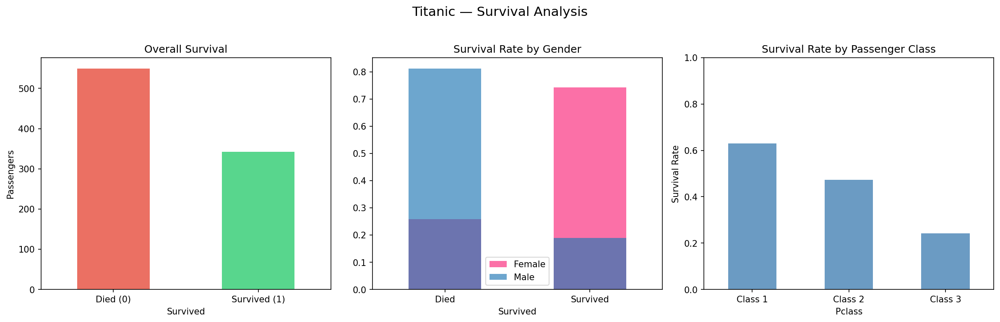
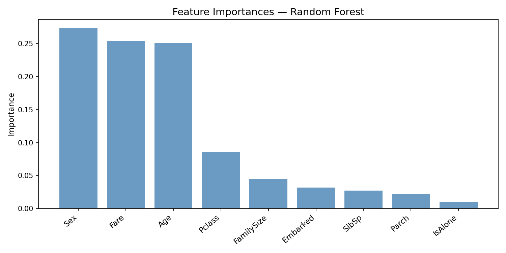

# 🚢 Titanic Survival Predictor

> **Kaggle Competition:** [Titanic – Machine Learning from Disaster](https://www.kaggle.com/c/titanic)

A complete, production-ready machine learning project that predicts passenger survival on the Titanic. It includes an interactive Streamlit web app, three ML models with cross-validation, and full EDA visualisations.

---

## Live Demo

[](https://github.com/LAKSHAY-ATREJA/Titanic-Survival-Prediction)

> **Deploy in one click using Streamlit Community Cloud:**
> 1. Fork this repo on GitHub
> 2. Visit [share.streamlit.io](https://share.streamlit.io) → "New app" → select your fork
> 3. Set main file to `app.py` → Deploy

---

## Features

| Feature | Description |
|---|---|
| 🔮 **Interactive predictor** | Enter any passenger profile and get instant survival predictions from all three models |
| 📊 **Exploratory Data Analysis** | Survival breakdowns by gender, class, age, and embarkation port |
| 🤖 **Three ML models** | Logistic Regression, SVM (RBF), and Random Forest with probability outputs |
| 📈 **Rigorous evaluation** | 5-fold stratified cross-validation with mean accuracy and std deviation |
| 🗂 **Kaggle-ready output** | Generates `PassengerId, Survived` CSV files for each model |
| 🚀 **CI/CD ready** | GitHub Actions workflow for automatic Hugging Face Spaces deployment |

---

## Demo Output

Running `python3 demo.py` produces:

```
============================================================
  Titanic Survival Prediction — Demo
============================================================

============================================================
DATASET SUMMARY
============================================================
  Training samples   : 891
  Survived           : 342 (38.4%)
  Age  (mean ± std)  : 29.4 ± 13.0

  Survival by Gender:
    Female    74.2%  (233/314)
    Male      18.9%  (109/577)

  Survival by Passenger Class:
    Class 1    63.0%  (136/216)
    Class 2    47.3%  (87/184)
    Class 3    24.2%  (119/491)

============================================================
MODEL EVALUATION  (5-Fold Stratified Cross-Validation)
============================================================
  Model                      CV Accuracy   Std Dev
  --------------------------------------------------
  Logistic Regression            0.7991    0.0169
  SVM (RBF kernel)               0.6824    0.0164
  Random Forest                  0.8227    0.0226
============================================================
```

---

## Screenshots

| Survival Analysis | Feature Importance |
|---|---|
|  |  |

---

## Project Structure

```
Titanic-Survival-Prediction/
├── .github/
│   └── workflows/
│       └── deploy-hf-spaces.yml   # Auto-deploy to Hugging Face Spaces
├── .streamlit/
│   └── config.toml                # Streamlit theme config
├── data/
│   ├── train.csv                  # Training set (891 passengers)
│   ├── test.csv                   # Test set (418 passengers)
│   └── output/                    # Generated submission CSVs
├── images/                        # EDA and result charts
├── KaggleAux/
│   ├── __init__.py
│   └── predict.py                 # statsmodels logit prediction helper
├── Python Examples/
│   ├── agc_simp_gendermodel.py    # Baseline: gender-only model
│   ├── agcgenderclassmodel.py     # Gender + class + fare lookup model
│   ├── agcfirstforest.py          # Random Forest with NumPy arrays
│   └── agc_embark_class_gender.py # statsmodels Logit regression
├── app.py                         # Streamlit interactive web app
├── demo.py                        # Standalone CLI demo (start here)
├── requirements.txt
├── .env.example
└── ReadMe.md
```

---

## Installation

**Requirements:** Python 3.9+

```bash
# 1. Clone the repository
git clone https://github.com/LAKSHAY-ATREJA/Titanic-Survival-Prediction.git
cd Titanic-Survival-Prediction

# 2. Create and activate a virtual environment
python3 -m venv venv
source venv/bin/activate      # Windows: venv\Scripts\activate

# 3. Install dependencies
pip install -r requirements.txt
```

---

## How to Run

### Interactive Web App (recommended)

```bash
streamlit run app.py
```

Opens at [http://localhost:8501](http://localhost:8501) with three tabs:

- **🔮 Predict** — enter passenger details and get model predictions with probabilities
- **📊 Dataset Analysis** — survival charts and breakdown tables
- **🤖 Model Performance** — cross-validation results and feature importances

### CLI Demo

```bash
python3 demo.py
```

Runs the full pipeline — preprocessing → cross-validation → submission files → charts — in under 30 seconds.

### Individual Example Scripts

```bash
# Baseline gender model
python3 "Python Examples/agc_simp_gendermodel.py"

# Gender + class + fare lookup
python3 "Python Examples/agcgenderclassmodel.py"

# Random Forest via scikit-learn
python3 "Python Examples/agcfirstforest.py"

# statsmodels Logit regression
python3 "Python Examples/agc_embark_class_gender.py"
```

### Interactive Notebook

```bash
jupyter notebook Titanic.ipynb
```

---

## Environment Variables

This project **does not require API keys** for local use.

For automated deployment to Hugging Face Spaces via GitHub Actions, add one repo secret:

| Secret | Where to get it |
|---|---|
| `HF_TOKEN` | [huggingface.co/settings/tokens](https://huggingface.co/settings/tokens) |

See `.env.example` for full documentation.

---

## Cloud Deployment

### Option A — Streamlit Community Cloud (easiest)

1. Push to a public GitHub repo
2. Visit [share.streamlit.io](https://share.streamlit.io) → "New app"
3. Select the repo, set main file to `app.py`
4. Click **Deploy** — live URL in ~60 seconds

### Option B — Hugging Face Spaces (auto via GitHub Actions)

1. Create a Space at [huggingface.co/new-space](https://huggingface.co/new-space) (SDK: Streamlit)
2. Generate a write token at [huggingface.co/settings/tokens](https://huggingface.co/settings/tokens)
3. Add `HF_TOKEN` as a GitHub Actions secret in repo Settings → Secrets
4. Enable the CI workflow (requires GitHub OAuth `workflow` scope):
   ```bash
   gh auth refresh --hostname github.com --scopes workflow
   git push origin main
   ```
5. Push to `main` — the workflow in `.github/workflows/deploy-hf-spaces.yml` deploys automatically

---

## Model Results

| Model | CV Accuracy (5-fold) | Std Dev |
|---|---|---|
| Logistic Regression | 79.9% | ±1.7% |
| SVM (RBF kernel) | 68.2% | ±1.6% |
| **Random Forest** | **82.3%** | ±2.3% |

---

## Dataset

| File | Rows | Description |
|---|---|---|
| `train.csv` | 891 | Labelled training data (includes `Survived`) |
| `test.csv` | 418 | Unlabelled test data for Kaggle submission |

Features used:

| Feature | Description |
|---|---|
| `Pclass` | Passenger class (1, 2, 3) |
| `Sex` | Gender (encoded: 0=female, 1=male) |
| `Age` | Age in years (median-imputed where missing) |
| `SibSp` | Number of siblings / spouses aboard |
| `Parch` | Number of parents / children aboard |
| `Fare` | Ticket fare (median-imputed where missing) |
| `Embarked` | Port: C=Cherbourg, Q=Queenstown, S=Southampton |
| `FamilySize`* | SibSp + Parch + 1 |
| `IsAlone`* | 1 if travelling alone, 0 otherwise |

\* Engineered features added during preprocessing.

---

## Tech Stack

| Library | Purpose |
|---|---|
| **pandas** | Data loading, cleaning, feature engineering |
| **NumPy** | Array operations |
| **Matplotlib** | Visualisation |
| **scikit-learn** | Logistic Regression, SVM, Random Forest, cross-validation |
| **statsmodels** | Logit regression with statistical summaries |
| **patsy** | R-style model formula syntax |
| **Streamlit** | Interactive web app |
| **Jupyter** | Interactive notebook exploration |

---

## Project Info

- **Type:** ML Classification — tutorial / Kaggle benchmark
- **Dataset:** [Kaggle Titanic: Machine Learning from Disaster](https://www.kaggle.com/c/titanic)
- **Python:** 3.9+
- **License:** MIT
